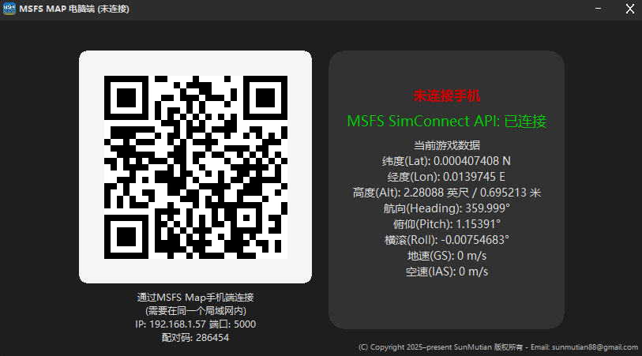
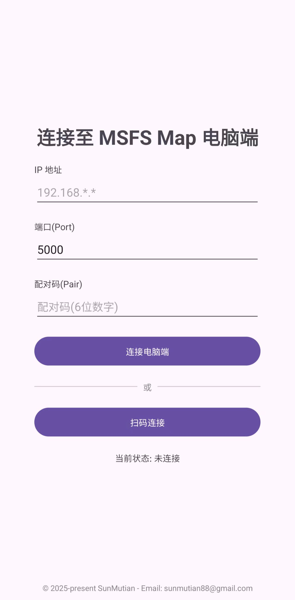
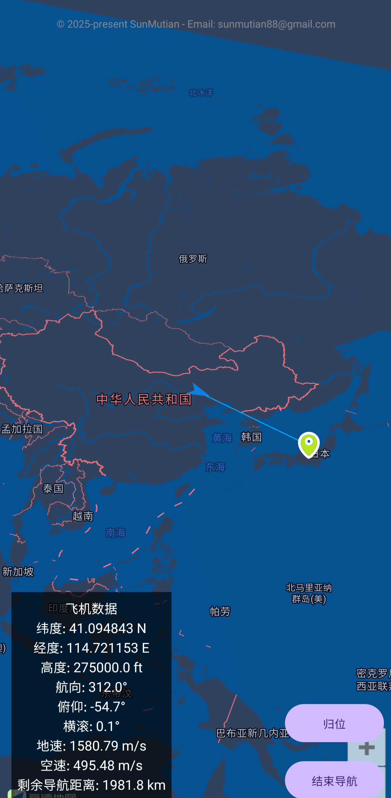
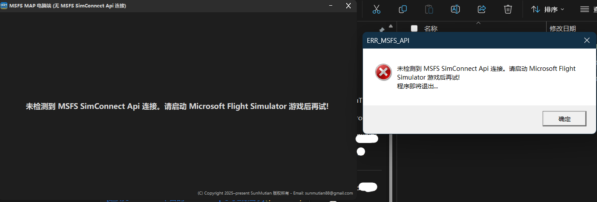

# MSFS Map

> 一个用于微软模拟飞行的辅助地图插件。由于游戏内置地图信息有限，我开发了这款插件以提供更全面的地图显示。使用方式简单：在电脑端运行数据传输程序，即可在Android手机端实时接收并查看完整地图信息。Windows电脑版本使用了原生 Win32 API 几乎不占用电脑性能。

* 版权所有 © 2025-present SunMutian
* Email: sunmutian88@gmail.com
* 时间: 2025-12-05
* 本软件遵循 CC BY-NC-SA 4.0 协议，不得用于商业用途！

# ⬇️ 下载发行版

[适用于WIndows x64平台的MSFS Map电脑端程序](https://github.com/sunmutian88/msfs_map/raw/refs/heads/main/Release/MSFSMap_Windows_x64.zip)

[适用于Android平台的MSFS Map手机端程序](https://github.com/sunmutian88/msfs_map/raw/refs/heads/main/Release/MSFSMap_Android.apk)

# ⭐ 软件使用方法

### 当你打开 MSFS Map WIndows 端你会看到如下界面:



> 确认 MSFS SimConnect API 为连接状态时打开 MSFS Map Android 版本App:



> 你可以选择手动填写配对信息(IP,端口,配对码)后点击 **连接电脑端** 进行连接。也可以点击 **扫码连接** 后扫描 Windows 版本 MSFS Map 二维码进行连接。



> 进入到地图页面后左下角会显示当前游戏数据，右下角有归位和导航功能。到此配置完成!

### 注意: 电脑端与手机端的数据传输依靠局域网，需要两台设备同时处于同一个 Wi-fi 环境下。

# 🤔 软件常见问题解决方法

### 由于找不到 XXX.dll，无法继续执行代码。重新安装程序可能会解决此问题


#### Windows 版本需要安装 Visual C++ 运行依赖才能运行! 安装VC++运行库即可解决。

> 运行依赖已附带在 Windows 发行版本程序压缩包里。

#### 但是如果提示的是确实 SimConnect.dll 那么就说明你没有正确安装程序

> 正确的Windows程序目录应为:

```
├─ MSFSMap.exe
└─ SimConnect.dll
```

### 如果软件打开软件时提示

```text
未检测到 MSFS SimConnect Api 连接。请启动 Microsoft Flight Simulator 游戏后再试!
```



#### 解决方法: 运行 Microsoft Flight Simulator 游戏后再试。

### 如果提示连接失败

#### 解决方法

1. 检查 MSFS Map 电脑端与手机端是否处于同一个 Wifi 环境下
2. 检查 Windows 防火墙是否阻止了 5000 端口的连接(简单粗暴的方法是直接关闭 Windows 防火墙)
3. 检查电脑和手机的内网IP是否处于同一个子网(需保证两个设备的内网IP的前三段保持一致)。
   > 例如: 手机 IP : 192.168.1.89 电脑 IP : 192.168.1.57  (连接成功)
   > 例如: 手机 IP : 192.168.5.64 电脑 IP : 192.168.1.66  (连接失败)

# 📇 项目目录介绍

```text
├─ Android   (MSFS Map 安卓手机端项目源代码目录)
│  ├─ ...
├─ CPP
│  └─ MSFSMap  (MSFS Map 电脑端项目源代码目录)
│      └─ x64     (Bin)
│      └─ MSFSMap.slnx    (Visual Studio 项目文件)
│      └─ ...
├─ LOGO     (APP LOGO)
│  └─ ICON   (.ico 版本 LOGO)
└─ Release   (发行版本)README_IMG
└─ README_IMG (README文件图片资源存放处)
│      └─ ...
└─ LICENSE  (CC BY-NC-SA 4.0 协议)
└─ README.md  (自述文件)
```

# 🌟 打赏

> 您的打赏是我持续开发的动力!


### 谢谢!

# ⚖️ 本软件遵循 CC BY-NC-SA 4.0 协议

> 详情请查看 LICENSE

### 您可以自由地：

共享 — 在任何媒介以任何形式复制、发行本作品；

演绎 — 修改、转换或以本作品为基础进行创作；

只要你遵守许可协议条款，许可人就无法收回你的这些权利。

### 惟须遵守下列条件：

署名 — 您必须给出适当的署名​​，提供指向本许可协议的链接，同时标明是否（对原始作品）作了修改​​。您可以用任何合理的方式来署名，但是不得以任何方式暗示许可人为您或您的使用背书。

非商业性使用 — 您不得将本作品用于商业目的​​。

相同方式共享 — 如果您再混合、转换或者基于本作品进行创作，您必须基于与原先许可协议相同的许可协议分发您贡献的作品。

没有附加限制 — 您不得适用法律术语或者技术措施从而限制其他人做许可协议允许的事情。

---

END


