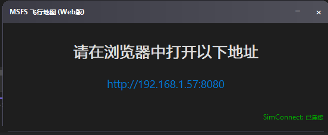
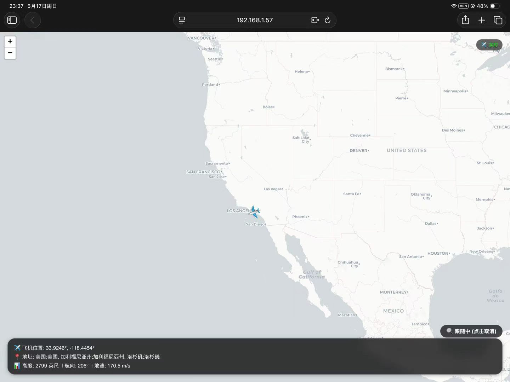

# MSFS Map – 纯 Web 版

[](https://creativecommons.org/licenses/by-nc-sa/4.0/)

> **⚠️ 注意：本分支 (`web_version`) 为纯 Web 版的独立项目**，主分支（`main`）保留了旧版代码及编译文件。

**MSFS Map** 是一个通过 SimConnect API 连接 Microsoft Flight Simulator 的实时地图工具。
**本版本为纯 Web 版**：电脑端运行后，自动启动内置 Web 服务器，同一局域网内的任何设备（手机、平板、电脑）只需用浏览器打开显示的地址，即可查看飞机实时位置、飞行数据和逆地理编码地址。

> **不再需要手机客户端，也无需配对码**。一切通过浏览器完成。

## ✨ 主要特点

- 🖥️ **纯 Web 访问** – 电脑端只显示局域网地址，手机/平板扫码或输入地址即可使用。
- 🗺️ **交互式地图** – 基于 Leaflet + OpenStreetMap，支持缩放、拖动，可一键跟随飞机。
- 📍 **自动地址解析** – 实时显示飞机所在国家、省/州、城市（通过 Nominatim API）。
- 📊 **完整飞行数据** – 经纬度、高度、航向、地速、俯仰/横滚等一目了然。
- 🌓 **深色/浅色主题** – Windows 窗口自适应系统主题，网页地图明亮清晰。
- 🌐 **多语言界面** – 桌面端根据系统语言自动切换中英文；网页端也内置中英文（JS 动态切换）。

## 📸 截图




## 🚀 快速开始

### 方式一：下载预编译 exe（推荐）

1. 前往 [Releases](https://github.com/sunmutian88/msfs_map/tree/web_version/releases) 下载最新 `MSFSMap_Web.exe`。
2. 确保电脑与手机/平板连接 **同一局域网**。
3. 运行 `MSFSMap_Web.exe`，窗口会显示类似 `http://192.168.1.100:8080` 的地址。
4. 用手机/平板浏览器扫描二维码，或直接输入该地址。
5. 浏览器中即可看到飞机位置（需要 MSFS 正在运行且飞机在空中或地面）。

### 方式二：从源码编译

```bash
git clone https://github.com/sunmutian88/msfs_map.git
cd msfs_map
git checkout web_version
# 使用 Visual Studio 2022 打开项目，编译即可
```

## 🌟 打赏

> 您的打赏是我持续开发的动力!

- **波场链 TRON (TRX / TRC20)**
  
  `TS56wnaX23LxG5rB3WBJKei5zv88888888` (尾号8个8)
  
  或
  
  `TQgBcWcvJiksX3um5FbSr1kFjZ33333333` (尾号8个3)
- **以太坊链 Ethereum / BSC / Polygon (ERC20 / BEP20)**
  
  `0x57B91fC456A773E9077C49eaF66D63f888888888` (尾号9个8)


